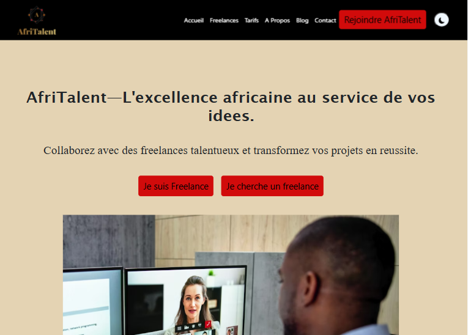

# AfriTalent
Projet fil rouge _ Plateforme de mise en relation entre freelances africains et cliens.
Auteur : Adja Fatou SENE
Promotion : L1 Web _ ISI

## Contexte et objectif du projet
Le marche du freelance tech en Afrique connaissant une croissance explosive ,
**AfriTalent** est une site vitrine complet developpe pour une plateforme fictive de mise en relation entre les freelances tech (developpeurs, designers, createurs de contenu...) et les entreprises.

Ce site a pour objectif majeur de :
* Presenter globalement la plateforme et ses fonctionnalites.
* Exposer les grilles de Tarifs et mettre en avant des profils de freelances.
* Convaincre les deux cibles (freelance et entreprise)de s'inscriere sur la plateforme.

## Lien du site
Le site est entierement deploye et accessible en ligne :
https://adjafatou-sene.github.io/SENE-AdjaFatou-AfriTalent/

# Apercu du site
Voici une capture d'ecran de la page d'acceuil:

#Fonctionnalites et tecnologies
* **HTML5 / CC3** : structure semantique complete et stylisation moderne.
* **Responsive Design** : Adapte aux mobiles, tablettes et ordinateurs.
* **Javascript (JS)** : fonctionnalites interactives et dynamique sur le site'
* **Accessibilite** : Tous les attributs alt des images ont ete rigoureusement verifieset integres.

## Structre du depot 
Le projet respect l'arborescencs suivante :

NOM-Prenom-AfriTalent/
├── index.html
├── freelances.html
├── tarifs.html
├── about.html
├── contact.html
── css/
│ └── style.css
├── js/
│ └── main.js
├── images/
│ └── (vos images, logos, avatars)
├── docs/
│ └── SENE_AdjaFatou_Presentation.pptx
├── README.md
└── .gitignore
